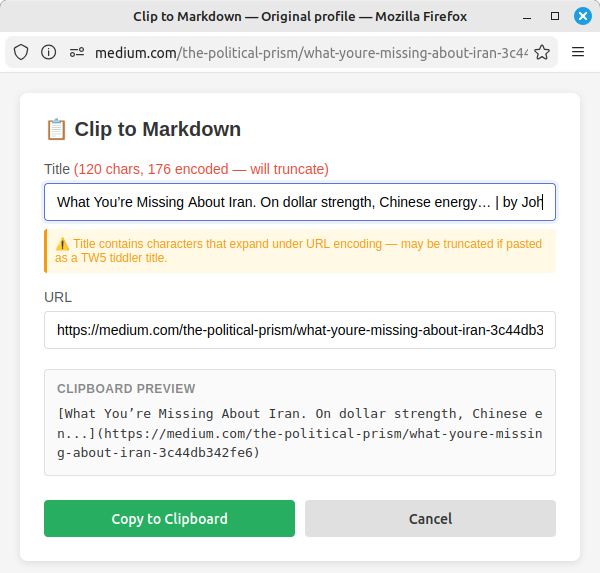

# Archive: Bookmarklet for Markdown Clipping

## User

We want to do this:

Develop: Browser Bookmarklet to Clip Tab/Text Selections into Pasteable Bookmark-Style Markdown Content

Per this GitLab issue:
https://gitlab.com/mindcurrent-public/sys-config_linux-pcs/sys-config_pc_linux-mint_c2024/-/work_items/55

I have uploaded the additional code and documents discussed in this issue.

*Uploaded files: bookmarklet_firefox.js, funcs.js, form.html, DYNAMIC-PATH-CONFIG.md, URL-ENCODING-TRUNCATION.md, HARDENING-DOCUMENTATION.md*

## Assistant

Let me fetch that GitLab issue to understand the full requirements.

Got it. I've read the GitLab issue and all the uploaded files. Here's my understanding of what we're building:

**New variant** of your TW5 bookmarklet that instead of saving a tiddler via the Node.js server, simply copies formatted markdown to the clipboard — ready to paste into any markdown editor (including TW5 tiddlers).

Before I build, let me confirm a couple of design decisions:

*Presented interactive questions:*

1. Do you want a popup form (to review/edit the title before copying), or a direct clipboard copy with a brief toast notification?
   - Options: Direct clipboard (no form, instant copy) / Popup form (review/edit title, then copy) / Both versions (I'll decide later)

2. For the 'with selection' case, what markdown format do you want?
   - Options: `> blockquote selection\n\n[Title](url)` / `selection text\n\n[Title](url)` / `selection text\n— [Title](url)`

3. Title truncation: since this is clipboard output (no filesystem), do you still want length limits?
   - Options: Yes, keep truncation (~150 chars) for readability / Yes, keep TW5-safe truncation (URL-encoding-aware) / No truncation needed for clipboard output

Each has tradeoffs worth noting: the overlay approach is the most portable (nothing to install or serve) but inherits the page's CSS which can cause styling conflicts. The `about:blank` popup is clean and isolated but Firefox may block it as a popup on some sites. The standalone server is the most robust but adds a process to manage.

## User

Q: Do you want a popup form (to review/edit the title before copying), or a direct clipboard copy with a brief toast notification?
A: Popup form (review/edit title, then copy)

Q: For the 'with selection' case, what markdown format do you want?
A: Let's go with number one, but let's also document options TW5 and three because those are some really elegant choices and I may change my mind later.

Q: Title truncation: since this is clipboard output (no filesystem), do you still want length limits?
A: Yes, keep TW5-safe truncation (URL-encoding-aware)

## Assistant

Great choices. Let me read all the uploaded files carefully, then build this out.

*Built three files: `bookmarklet_clipboard_firefox.js`, `form-clipboard.html`, and `README-clipboard-variant.md`.*

The form was served from `http://127.0.0.1:1234/files/form-clipboard.html` (TW5 server) and included `funcs.js` as a dependency. The form included TW5-specific features: dynamic base path config fetching from TW5 server, encoding-aware truncation, and character counters showing encoded byte counts.

## User

What's up with your console message?

```
TW5 server not reachable — using default max: 100
```

We shouldn't be using any TW5 five functionality at all here.

## Assistant

You're right — that's a leftover from the TW5 variant that has no business being here. The clipboard tool shouldn't be phoning home to a TW5 server. Let me strip out `fetchBasePathConfig()` entirely and just use a hardcoded conservative default.

*Removed `fetchBasePathConfig()` and all TW5 server calls. Replaced dynamic `maxEncodedLength` with a static `const MAX_ENCODED_LENGTH = 100`. Updated the README to match.*

## User

Okay, this has got some big problems.
You're making it so that I'm serving the form from the TiddlyWicker server and I don't want that at all.
I want it to be completely standalone, not dependent on TiddlyWiki or Obsidian or anything.
If anything, this form could be put into some place on localhost where Firefox can get to it easily.

## Assistant

You're right — the bookmarklet still points at `http://127.0.0.1:1234/files/`, which is the TW5 server. That defeats the purpose of making this independent.

The tricky constraint is that a bookmarklet runs in the context of the current page (e.g. `https://example.com`), and Firefox blocks opening `file://` URLs from an HTTPS context. So we can't just point at a local HTML file. Here are the realistic standalone approaches:

*Presented interactive question:*

How should the form be delivered? Each avoids any dependency on TW5 or other servers.
- Options: Inject overlay into current page (zero files, everything lives in the bookmarklet itself) / Bookmarklet opens about:blank popup and writes the form via document.write (no external file) / Serve form from a tiny standalone HTTP server (e.g. 3-line Python script on a dedicated port)

Each has tradeoffs worth noting: the overlay approach is the most portable (nothing to install or serve) but inherits the page's CSS which can cause styling conflicts. The `about:blank` popup is clean and isolated but Firefox may block it as a popup on some sites. The standalone server is the most robust but adds a process to manage.

## User

Q: How should the form be delivered? Each avoids any dependency on TW5 or other servers.
A: Bookmarklet opens about:blank popup and writes the form via document.write (no external file)

## Assistant

Good call. The entire tool becomes self-contained in the bookmarklet — no files to serve, no servers to run. The bookmarklet opens `about:blank`, sets the captured data on the popup window, and writes the full form HTML via `document.write`.

Since the form HTML needs to be escaped and packed into a bookmark URL string, I'll create a build script so you can edit the readable source and regenerate the bookmarklet.

*Created three files: `form-clipboard.html` (source HTML), `build-bookmarklet.py` (build script), and `bookmarklet_clipboard_firefox.js` (built output at 11.3 KB). The build script reads the HTML, escapes it for embedding in a JS string, and wraps it in the bookmarklet shell.*

Completely rearchitected. Zero server dependencies — here's the new flow:

The bookmarklet captures title/URL/selection, opens an `about:blank` popup, sets `window._clipData` on it, then writes the entire form via `document.write()`. No URL params, no `127.0.0.1`, no XHR, no fetch, no external files to serve. The built bookmarklet is 11.3 KB (Firefox supports up to ~65 KB).

The workflow for editing is: modify `form-clipboard.html` → run `python3 build-bookmarklet.py` → paste the output into your Firefox bookmark URL field.

## User



Why do I still see functionality related to TW5?

## Assistant

Good point — the UI is still framed around TW5 concerns. The warning literally says "TW5 tiddler title" and the whole encoding counter exists because of TW5 filesystem limits.

For a standalone clipboard tool, the title in `[Title](url)` is just markdown text — there's no filesystem involved. Let me check what you actually want here:

*Presented interactive question:*

The title truncation and encoding warnings exist purely for TW5 .tid filename safety. For a standalone clipboard tool, what should we do?
- Options: Remove truncation entirely — it's just markdown text, no filesystem limits apply / Keep truncation but reframe generically / Keep truncation as a safety net but hide the encoding counter and warnings from the UI

## User

I'm sorry, I gave the wrong input. I meant to say let's remove the truncation entirely.

## Assistant

Makes total sense — it's just markdown text going to the clipboard. Let me gut all of that.

*Started to rebuild but user interrupted.*

## User

That's fine, but before you do that, let me ask another question. Why did you go through this entire cycle of generating the JavaScript to put into the bookmarklet using Python? Why not just generate the JavaScript directly? Why do you need to ship an entire Python script?

## Assistant

You're right — that's overengineered. I can just generate the final `javascript:(...)` string directly and give you that. If you ever need to edit it later, you can bring the source back here and I'll rebuild it. No reason to ship a build pipeline for a single output file.

So the deliverables should just be:

1. `form-clipboard.html` — the readable source (for reference/future edits)
2. `bookmarklet_clipboard_firefox.js` — the final `javascript:(...)` string, ready to paste into a bookmark

## User

Again, why number one? Why don't you just generate the JavaScript?

## Assistant

You're right. The whole point of the `about:blank` approach is that everything lives inside the bookmarklet. There's no separate file to deploy. The only deliverable is the `javascript:(...)` string you paste into the bookmark URL field.

*Rebuilt everything as a single deliverable: `bookmarklet_clipboard_firefox.js` at 5.5 KB. All TW5 artifacts removed — no sanitization, no truncation, no encoding counters, no warnings, no filesystem constants. Only markdown-relevant processing: escaping `[` and `]` so they don't break link syntax.*

## User

Let's make a few changes here.

First the easy one. Let's move to format B -- Plain Selection + Link.

Also, I don't think we need the markdown preview on the form. Let's get rid of that.

## Assistant

*Rebuilt the bookmarklet with both changes: removed preview section (HTML, CSS, and `updatePreview` function), switched `buildMarkdown()` from blockquote to plain `selection + "\n\n" + link`. Size reduced from 5.5 KB to 4.2 KB.*

## User

Quick question:. Is a bookmarklet required to have only one line?

## Assistant

No. Firefox handles multi-line `javascript:` bookmarks fine. The one-line convention is just a minification habit.

That said, in our case most of the content is inside the `document.write('...')` string literal, so that part has to stay as one continuous string. But the bookmarklet wrapper code around it could absolutely be spread across multiple lines for readability. It won't make a practical difference here since the HTML string is the bulk of the file anyway.

## User

If it looks like the bulk of what's inside that `document.write('...')` section is the form, correct?

## Assistant

Yes, exactly. The bookmarklet is roughly:

- ~350 bytes: the outer wrapper (capture title/URL/selection, open popup, set `_clipData`)
- ~3,800 bytes: the HTML form inside `document.write('...')` — CSS, markup, and the JS functions for `buildMarkdown`, `copyToClipboard`, `handleCopy`, and `init`

So about 90% of the file is the form string.

## User

Is it possible to factor any or all of the JS functions:
`buildMarkdown`, `copyToClipboard`, `handleCopy`, and `init`
...out from the inside of the `document.write('...')` section?

## Assistant

Yes. After `w.document.write(...)` and `w.document.close()`, the popup's DOM is fully ready. So you can define all the functions directly on the popup window from the bookmarklet wrapper:

```javascript
// document.write contains ONLY HTML + CSS — no <script> tag at all
w.document.write('<!DOCTYPE html>...<div id="btnCopy">...</div>...</html>');
w.document.close();

// JS lives here as real code, not escaped-string-inside-a-string
function buildMarkdown(title, url, sel) { ... }

w.document.getElementById('btnCopy').addEventListener('click', function() {
    handleCopy();
});
// etc.
```

The payoff is that `document.write` becomes just HTML + CSS (a dumb string), and all the logic is real JavaScript in the bookmarklet body — no more escaping backslashes inside a string literal inside a string literal. Much easier to read and edit.

Want me to rebuild it that way?

## User

If we do it that way, will we still be able to stuff all of this into a regular old bookmark?

## Assistant

Yes. A `javascript:` bookmark can contain any amount of valid JavaScript — function declarations, closures, DOM manipulation, all of it. Firefox's limit is ~65 KB and we're at ~4 KB. Factoring the JS out of the string would actually make it slightly *smaller* since we'd lose all the escape overhead (`\\n`, `\\"`, etc.).

The only thing that changes is where the code lives, not whether it fits.

## User

Let's try it because the original version is some of the ugliest fucking JavaScript I've ever seen in my life.

## Assistant

Can't argue with that. Let me rebuild it properly.

*Created a clean 150-line bookmarklet with clear separation: `document.write` contains only HTML + CSS (no `<script>` tag), all JS logic runs as real code after `document.close()` operating on the popup's DOM via a `doc` variable.*

Night and day. 150 lines of readable JavaScript instead of one monstrous escaped string. The structure is now:

- **Lines 1–7:** Capture title, URL, selection from the current page
- **Lines 9–13:** Open the `about:blank` popup
- **Lines 15–55:** `document.write` — pure HTML + CSS, no `<script>` tag, no escaped JS
- **Lines 59–68:** Populate the form fields directly (no `_clipData` indirection — the captured variables are right there in the closure)
- **Lines 70–150:** Real JavaScript functions: `escBrackets`, `buildMarkdown`, `copyToClipboard`, `handleCopy`, event listeners

Everything after `w.document.close()` is just normal code operating on `doc` (the popup's document). No more backslash escaping inside a string inside a string.

## User

Can you save that original monster file as an artifact?
I'd like to show it to students so that they will never, ever, ever produce anything like that.

## Assistant

*Created `DONT_DO_THIS_bookmarklet_monster.js` with a header comment explaining exactly what's wrong with it and pointing to the clean version.*

There you go. Added a header comment at the top explaining exactly what's wrong with it and pointing to the clean version — so students get the lesson without having to decode 4 KB of escaped string to figure out what went wrong.

## User

Well, THAT fucking dies.

## Assistant

Right — I told you Firefox handles multi-line bookmarks fine, but that was wrong. When you paste into the bookmark URL field, Firefox strips the newlines. That turns every `//` comment into a line that eats the code after it.

The fix is straightforward: remove all `//` comments and make sure semicolons are explicit everywhere. The file can stay multi-line for readability — it just needs to survive being flattened.

*Rebuilt the bookmarklet with zero `//` comments (only `/* */` where needed) and explicit semicolons. Verified by flattening with `tr -d '\n'` and running `node --check` — syntax passes clean.*

Two bugs killed the previous version when Firefox flattened it:

1. **`//` comments** — with newlines stripped, they ate all code to their right on the merged line
2. **`\` line continuations** — with newlines stripped, `\` merged with the next character creating garbage escape sequences (`\b` = backspace, `\t` = tab, etc.)

Fixed by using only `/* */` comments and `+` string concatenation. I verified by flattening the file with `tr -d '\n'` and running `node --check` on the result — syntax passes clean.

## User

I want you to use the comments from the previous version because they're useful. So go ahead and repackage it one more time and use only comments in the format that works:
in other words, `/* */` comments

## Assistant

*Rebuilt with all comments restored as `/* */` block comments. Verified: zero `//` comments, passes `node --check` when flattened.*

All the comments from the previous version are back, just using `/* */` instead of `//`. Verified it survives `tr -d '\n'` and passes `node --check` when flattened.

## User

And did you confirm the `+` string concatenation corrections?

## Assistant

Confirmed:

- **0** backslash `\` line continuations
- **50** `+` string concatenation joins in the doc.write section
- **No escape corruption** after flattening (no stray `\b`, `\t`, etc.)
- **Syntax check passes** on the flattened output

All three failure modes are covered: no `//` comments, no `\` continuations, clean `+` concatenation.

## User

How compatible is this bookmarklet with Chrome browsers?

## Assistant

There are two potential friction points with Chrome:

**Popup blocking** is the more likely issue. Chrome is stricter than Firefox about popups. Since a bookmarklet click counts as user activation, it generally works — but Chrome may still block it on some sites, especially if the site has its own popup-suppression logic. The bookmarklet already handles this with the `if (!w)` alert, so the user at least gets feedback.

**Clipboard access from an `about:blank` popup** is the subtler risk. Our copy runs inside a button click handler (clear user activation), and `about:blank` inherits the opener's origin, so `navigator.clipboard.writeText()` should work when the opener page is HTTPS. The `execCommand('copy')` fallback covers the edge cases. Based on what I found, people have confirmed that `execCommand` in Chrome bookmarklets works when the script runs directly in the bookmark — and our copy happens in a click handler inside the popup, which is even better for user activation requirements.

In short: it should work in Chrome as-is. The popup blocker is the most likely thing you'd hit, and we already handle that gracefully.

## User

How do I test pop up blocking behavior in Firefox?

## Assistant

The quickest way is to toggle Firefox's popup blocker and see what happens:

1. Go to `about:preferences#privacy`
2. Scroll to **Permissions**
3. There's a checkbox: **Block pop-up windows**
4. With it **checked**, click the bookmarklet — you should see the "Popup blocked" alert we added
5. With it **unchecked**, it should open normally

You can also test per-site exceptions without globally disabling the blocker — click the **Exceptions...** button next to that checkbox and add specific sites you want to allow or block.

To see what Firefox is actually doing under the hood, open the Web Console (`Ctrl+Shift+K`) before clicking the bookmarklet. If a popup gets blocked, Firefox logs a message there like `"Opening popup was blocked"` — that's more informative than just watching whether the window appears.

## User

What would it take to turn this into an extension with a button on the toolbar for Firefox?

## Assistant

Not much, actually. The hard parts are already done — the form UI and the markdown/clipboard logic. The main changes are about *how* you get the tab's data:

**What a Firefox extension needs:**

- `manifest.json` — declares the toolbar button, permissions, and files
- `popup.html` + `popup.js` — basically what we already have, but the form opens as the toolbar button's popup instead of an `about:blank` window
- One small `browser.tabs` call to get the active tab's title and URL
- A tiny content script (injected on demand) to grab `window.getSelection()` since the popup can't see the page's DOM directly

**What gets simpler:**

- No popup blocker issues — it's a native browser panel
- Clipboard API works reliably (extensions get `clipboardWrite` permission)
- No `document.write` — it's just a normal HTML file

**What's new:**

- You'd need to load it as a temporary extension for development (`about:debugging`) or package and sign it through AMO for permanent install

## User

Please explain both:
1. "temporary extension for development (about:debugging)"
2. "package and sign it through AMO for permanent install"
Keeping in mind that I've never deployed a browser extension.

## Assistant

**1. Temporary extension via `about:debugging`**

This is Firefox's developer mode. You navigate to `about:debugging#/runtime/this-firefox`, click "Load Temporary Add-on...", and select any file from your extension folder (usually `manifest.json`). Firefox loads it immediately — the toolbar button appears, everything works. The catch: it disappears when you close Firefox. Every time you restart the browser, you have to go back to `about:debugging` and load it again. That's fine for development and testing, but annoying for daily use.

**2. Packaging and signing through AMO**

AMO is addons.mozilla.org — Mozilla's official extension marketplace. "Signing" means Mozilla cryptographically stamps your extension so Firefox trusts it. This is required for permanent installation in standard Firefox. The process goes roughly like this:

- You zip up your extension files
- Create a free account on addons.mozilla.org
- Upload the zip
- Choose whether to list it publicly (anyone can find and install it) or keep it unlisted (only people with the direct link can install it — good for personal tools like this)
- Mozilla runs automated checks and signs it (usually takes seconds to minutes for simple extensions)
- You download the signed `.xpi` file
- Double-click it or drag it into Firefox — it installs permanently, survives restarts, updates normally

For a personal tool like this, "unlisted" is what you'd want. You're not publishing to the world, you just need Mozilla to sign it so Firefox will keep it installed. Once signed, you can also share the `.xpi` with anyone else who wants it.

There's a third option worth mentioning: **Firefox Developer Edition** and **Firefox Nightly** allow permanently installing unsigned extensions by setting `xpinstall.signatures.required` to `false` in `about:config`. Standard Firefox doesn't allow this. If you happen to use Developer Edition, this skips the AMO step entirely.
